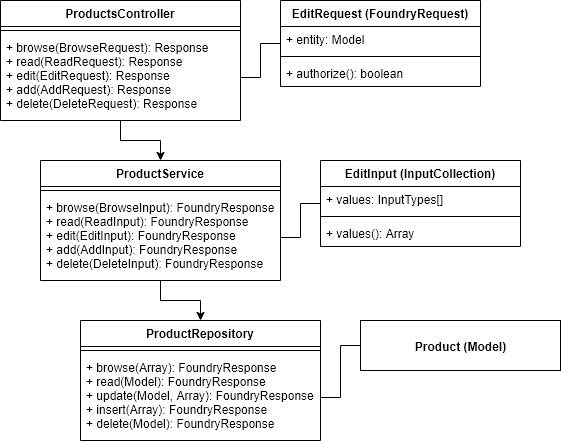

# Foundry Framework

## Overview
The Foundry Framework is built on top of Laravel and VueJS and uses many of the Laravel key features plus a few from the Foundry Framework.

The Architecture of the Foundry Framework is built around the concept of modularised blocks of code, with the end goal of making the system as DRY as possible.

## Concept
The core concept to the Foundry Framework is further separation of concerns using existing application development concepts such as Services and Repositories. This is based on the idea of primarily being an API first based system, allowing flexibility for newer front-end technologies in the future.



__The following outline the graph above:__

- **Input Collection**: A class that wraps a required set of input fields, often supplied via an HTTP Requests or other, which are then type cast to their correct data types using Input Types.
- **Input Types**: Classes that wrap known parameters for the system, such as a column on the database or an input from a Request. They are used with Input Collections to control the data type and other details about a field. Input Types can be seen as extensions of a table column and define its’ label, required values, valid values, help text and other such information. In short, they help us know exactly what the field meta data is and how to treat that field.
- **Foundry Request**: An extension of a Laravel Form Request, with a set of additional Traits that help provide addition details about an incoming request. A core feature of Foundry Requests work with a known route parameter of “{_entity}”, allowing for standard approaches for setting and getting the related Entity/Model with a request. The second feature Foundry Requests provide is authorisations directly as is from Laravel Form Requests.
- **Foundry Response**: A standard approach to wrapping a Service’s response so that the response can be universally used in a Controller or other Services, or virtually anywhere else. A foundry Response contains a basic structure that is easy to translated to a JSON response and contains a response status (true or false), response code (based on HTTP status codes), and a data key containing the response data, whatever that may be.
- **Services**: A basic class object providing a variety of business logic that can be called from anywhere. Instead of building business logic in Controllers, Services contain the core business logic. In addition, a service expects a known Input Collection, ensuring we have know and valid parameters for that Service method call.
- **Repositories**: A wrapper for the store and Models and provides convenience methods for interacting with the desired store, which in most cases is a Database table. Repositories work with their Models to execute the desired operation, such as insert, update, delete, etc. In the Foundry Framework we always use Repositories to interact with the Database and never Model classes directly. This future helps to isolate layers of business logic.

## Modules
Each of these concerns are grouped together and then added to a “Module”. A module is Laravel package and structured like a minified version of a Laravel App, with the same folders and structure seen in a Laravel Application. Modules work exactly the same way Laravel Packages work and each one has its’ own Service Provider, routes, config, etc. The concept is borrowed in some part from OctoberCMS which does a great job or module development.

Modules are then included into the app using the applications composer file, and the ```config/ap.php``` file, allowing for dependency management and control.

## Core Modules
The Foundry Framework comes with 2 core "Modules" which run the entire Foundry Application. These are Foundry Core and Foundry System. Core contains base classes, interfaces, abstracts, traits etc, and control the contracts of generic functionality of the Framework. System provides the application logic, is largely derived from a default Laravel Application, and contains the Kernel, Middleware, Request and Response handling.

## Themes
Themes are like Modules, but their purposes is centered around rendering the application or exposing it in some way other than as an API. As a Website as an example.

A theme can choose any way it wishes to handle a request and use the Services provided by other Modules in the system. 

## Packages
Packages are Javascript packages which are often connected to a Module and provide Javascript functionality, such as VueJS Plugins. For the most part, packages are imported through ```npm install file:../path/to/package```.

## Additional Reading

- [Modules](./modules.md)
- [Frontend](./frontend.md)
